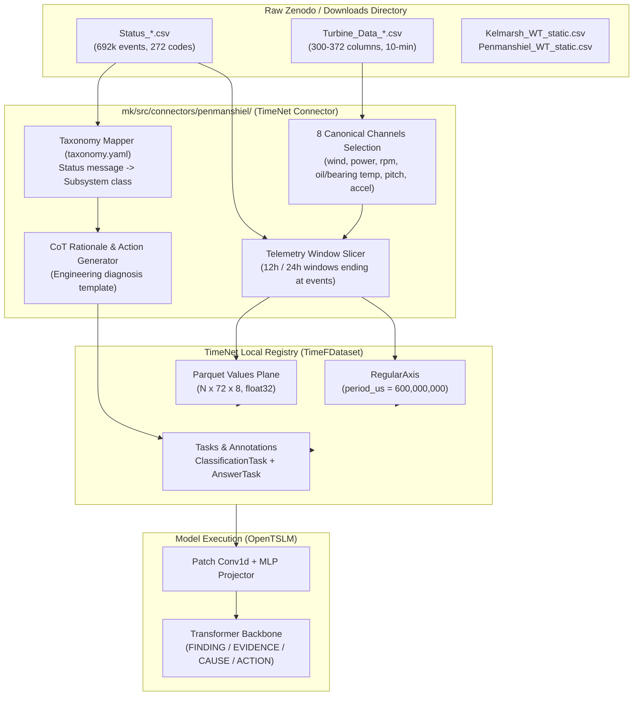

# 📋 Wind Turbine SCADA & Alarm Data Structure Report

> **Directory Inspected:** `/Users/maximiliankalk/Downloads/Turbine Data`  
> **Target Repository:** `zurich_ehl_timeseries/mk`  
> **Scope:** Comprehensive audit of raw Zenodo Greenbyte SCADA telemetry and status logs, complete extraction of all unique alarm/status combinations, and architectural comparison against the **TimeNet** dataset format used in `mk/`.

---

## 1. Executive Summary

| Metric | Value | Details |
|:---|:---|:---|
| **Total Files Inspected** | **197 files** | 96 `Status_*.csv`, 96 `Turbine_Data_*.csv` / `Device_Data_*.csv`, 3 Static/Mapping CSVs, 2 KMZ geographic maps |
| **Physical Subdirectories** | **16 folders** | 13 Turbine SCADA annual folders, 1 Grid Meter folder, 2 PMU folders |
| **Total Status Events** | **692,261 events** | Spanning 2016 through 2024 across 14 Penmanshiel turbines, Grid Meter, and PMUs |
| **Unique Status Combinations** | **342 combinations** | Unique tuples of `(Status, Code, Message, Comment, Service Contract Category, IEC Category)` |
| **Unique Combinations (No Comment)** | **320 combinations** | Ignoring operator comments |
| **Distinct Alarm / Status Codes** | **272 codes** | Numeric Greenbyte event codes (e.g., `0`, `10`, `64`, `1550`, `3125`) |
| **Distinct Status Messages** | **273 messages** | Text descriptions (1-to-1 with codes, except Code 250 with 2 punctuation variants) |
| **Non-Empty Operator Comments** | **45 unique comments** | Documented on only 163 events (0.02% of total), capturing rare critical maintenance operations |
| **Service Contract Categories** | **23 categories** | Populated on 227,589 events (32.9%), blank on 67.1% |
| **IEC 61400-26 Categories** | **8 categories** | Populated on 685,627 events (99.0%), blank on 1.0% |

## 2. Directory Structure & File Inventory

The directory contains exported data from the **Cubico Penmanshiel Wind Farm** (14 × Senvion MM82 turbines, 28.7 MW total capacity) alongside static metadata for the **Kelmarsh Wind Farm**:

```
/Users/maximiliankalk/Downloads/Turbine Data/
├── Kelmarsh_12.3MW_6xSenvion_MM92.kmz           # Kelmarsh geographic layout & turbine positions
├── Kelmarsh_WT_dataSignalMapping.csv            # Greenbyte signal ID to sensor title & unit mapping
├── Kelmarsh_WT_static.csv                       # Static turbine specs (MM92, 2050 kW, coordinates)
├── Penmanshiel_28.7MW_14xSenvion_MM82.kmz       # Penmanshiel geographic layout
├── Penmanshiel_WT_static.csv                    # Static turbine specs (MM82, 2050 kW, coordinates)
├── Penmanshiel_Grid_4464/                       # Substation grid meter telemetry & status (2016-2023)
├── Penmanshiel_PMU_4465/                        # Phasor Measurement Unit telemetry & status (2018-2023)
├── Penmanshiel_PMU_2023_2024_5969/              # Phasor Measurement Unit telemetry & status (2023-2025)
├── Penmanshiel_SCADA_2016_WT01-10_3107/         # Turbines WT01-WT10, year 2016 (9 turbines, WT03 omitted)
├── Penmanshiel_SCADA_2016_WT11-15_3107/         # Turbines WT11-WT15, year 2016 (5 turbines)
├── Penmanshiel_SCADA_2017_WT01-10_3114/         # Turbines WT01-WT10, year 2017
├── Penmanshiel_SCADA_2017_WT11-15_3115/         # Turbines WT11-WT15, year 2017
├── Penmanshiel_SCADA_2018_WT01-10_3113/         # Turbines WT01-WT10, year 2018
├── Penmanshiel_SCADA_2018_WT11-15_3116/         # Turbines WT11-WT15, year 2018
├── Penmanshiel_SCADA_2019_WT01-10_3112/         # Turbines WT01-WT10, year 2019
├── Penmanshiel_SCADA_2019_WT11-15_3117/         # Turbines WT11-WT15, year 2019
├── Penmanshiel_SCADA_2020_WT01-10_3109/         # Turbines WT01-WT10, year 2020
├── Penmanshiel_SCADA_2020_WT11-15_3118/         # Turbines WT11-WT15, year 2020
├── Penmanshiel_SCADA_2021_WT01-10_4460/         # Turbines WT01-WT10, year 2021
├── Penmanshiel_SCADA_2023_03_WT_01-10_5982/    # Turbines WT01-WT10, year 2023
└── Penmanshiel_SCADA_2024_WT_11-15_5966/        # Turbines WT11-WT15, year 2024
```

### Key Structural Observations:
1. **Turbine ID Scheme**: Penmanshiel contains 14 physical turbines named `WT01` through `WT15`, with **`WT03` permanently absent** (consistent with Cubico documentation).
2. **Turbine Partitioning**: Each calendar year is partitioned into two batches: `WT01-10` (9 turbines) and `WT11-15` (5 turbines).
3. **Auxiliary Sensors**: Includes Grid Meter (`Penmanshiel_Grid_4464`) and PMU meters (`Penmanshiel_PMU_4465`, `Penmanshiel_PMU_2023_2024_5969`) tracking high-voltage electrical interconnects.
4. **Kelmarsh Presence**: Kelmarsh data in this directory is restricted to metadata (`.csv`) and GIS coordinates (`.kmz`); full SCADA CSVs for Kelmarsh are held separately or downloaded via Zenodo (Record 16807551).

## 3. Raw Data Schemas & Header Signatures

### 3.1 `Status_*.csv` File Schemas
Every status file begins with metadata comment lines prefixed by `#`, followed by the column header.

| Signature | Comment Lines | Columns | File Count | Applicable Directory Subset |
|:---|:---:|:---:|:---:|:---|
| **Standard 9-Col** | 9 | 9 | 70 files | Penmanshiel SCADA 2016–2020 (WT01-10 & WT11-15) |
| **Auxiliary 9-Col** | 7 | 9 | 3 files | Grid Meter & PMU directories |
| **Extended 11-Col** | 9 | 11 | 23 files | Penmanshiel SCADA 2021, 2023, 2024 |

**Column Definitions across Status Files:**
1. `Timestamp start`: Start time of the status state (`YYYY-MM-DD HH:MM:SS`, UTC).
2. `Timestamp end`: End time of the status state (can be empty or `-` for ongoing alarms).
3. `Duration`: Interval duration (`HH:MM:SS` or `DD:HH:MM:SS`).
4. `Status`: High-level operational state (`Informational`, `Stop`, `Warning`, `Curtailment`, `Communication`).
5. `Code`: Unique integer identifier for the specific event/subsystem message.
6. `Message`: Plain-text description of the event (e.g., `System OK`, `Wind < start wind`, `Missing gear oil (high rpm)`).
7. `Comment`: Free-form text entered by wind farm operators or service engineers (99.98% null).
8. `Service contract category`: OEM/Operator contract attribution category (23 distinct categories).
9. `IEC category`: IEC 61400-26 operational availability category (8 distinct classes).
10. `Global contract category`: *(Extended schema only, 2021+)* Enterprise reporting category.
11. `Custom contract category`: *(Extended schema only, 2021+)* Site-specific reporting category.

### 3.2 `Turbine_Data_*.csv` File Schemas & Column Drift
Telemetry files record 10-minute aggregate sensor measurements (Mean, Min, Max, Standard Deviation):
- **Header Row**: Line 10 (starts with `# Date and time`). 9 preceding comment lines.
- **Drifting Column Count**: 
  - **2016–2020 SCADA**: 300 columns (70 populated signal prefixes with statistical variants).
  - **2021 SCADA**: 363 columns (+63 newly instrumented sensor channels).
  - **2023–2024 SCADA**: 372 columns (+9 additional electrical/thermal channels).
  - **Grid Meter**: 16 columns (Active/reactive power export, counter readings, solar irradiation).
  - **PMU**: 74 columns (Substation bus frequency, voltage angles, positive/negative sequence components).

## 4. Status Logs: Comprehensive Breakdown & Unique Combinations

### 4.1 Distribution by High-Level Status

| Status | Unique Combinations | Total Events | % of Total Events | Operational Meaning |
|:---|:---:|:---:|:---:|:---|
| **Informational** | 81 | 667,515 | 96.43% | Normal operational state changes, synchronizations, grid connections, low-wind pauses |
| **Stop** | 159 | 14,491 | 2.09% | Turbine trips, safety chain trips, manual stops, component fault shutdowns |
| **Warning** | 97 | 8,923 | 1.29% | Non-tripping advisory flags (e.g. slight bearing temp elevation, external curtailment) |
| **Communication** | 2 | 953 | 0.14% | SCADA gateway, router or optical fiber dropouts between turbine and substation |
| **Curtailment** | 3 | 379 | 0.05% | Grid operator active power limits (ANM) or deliberate derating (e.g. gearbox run-in) |

### 4.2 Cross-Tabulation: Status vs. IEC 61400-26 Availability Category

| Status | Full Performance | Partial Performance | Technical Standby | Out of Environmental Specification | Out of Electrical Specification | Forced outage | Scheduled Maintenance | Requested Shutdown | (Blank) | Total |
|:---|:---:|:---:|:---:|:---:|:---:|:---:|:---:|:---:|:---:|:---:|
| **Communication** | - | - | - | - | - | - | - | - | 953 | **953** |
| **Curtailment** | - | 379 | - | - | - | - | - | - | - | **379** |
| **Informational** | 409,899 | - | 91,894 | 164,143 | - | - | - | 51 | 1,528 | **667,515** |
| **Stop** | - | - | 5,872 | 3,012 | 274 | 3,430 | 1,673 | 162 | 68 | **14,491** |
| **Warning** | 1,868 | 2,226 | - | - | 17 | 727 | - | - | 4,085 | **8,923** |

### 4.3 Service Contract Categories (23 Distinct Classes)

| Service Contract Category | Unique Combos | Event Count | Primary Associated Alarms |
|:---|:---:|:---:|:---|
| `System OK (32)` | 5 | 103,011 | System OK, Reset of icing st. cd. possible, Manual snapshot |
| `External stop (low wind speed)  (5)` | 6 | 98,458 | Wind < start wind, Max. wind speed, Deviation winddirection > 60° |
| `Operating states  (28)` | 19 | 9,403 | Absence of wind during run-up, Fallback setpoints active, Gearbox warm-up stage |
| `Warnings (27)` | 98 | 9,322 | Overfrequency, Semi-automatic operation, High frequency - P reduction |
| `Manual stop (service)  (9)` | 19 | 3,145 | Manual yaw, Manual stop - on site, Manual stop without login |
| `External stop (grid) (4)` | 8 | 1,456 | Externally stopped, Grid loss, Min. voltage cut in |
| `Generator and Converter errors (20)` | 10 | 591 | Frequency converter not ready, Frequency converter error, Service generator brushes |
| `Safety stop of WEC (15)` | 11 | 541 | Tower oscillation Y level 1, Tower oscillation Y level 2, Tower oscillation X level 1 |
| `Remote stop (30)` | 8 | 396 | Manual stop - remote, Park master stop |
| `Sensor error (21)` | 13 | 295 | Implausible gear speed, Anemometer defect, Vane defect |
| `Mechanical error (23)` | 16 | 272 | Missing gear oil (high rpm), Low gearbox oil pressure, Uncontrolled yaw movement |
| `Pitch errors (18)` | 21 | 184 | Pitch controller communication error, Charging circuit pitch, Set point><actual value axis 1 |
| `Repeated error  (25)` | 1 | 164 | Repeating error BP52 |
| `Electrical error (24)` | 11 | 142 | Timeout ready for connection, Overload gear oil pump, Power-up relay |
| `External stop (climate) (6)` | 6 | 79 | Icing (stop), Icing (anemometer), Low gear oil temperature |
| `Safety chain (13)` | 7 | 51 | Safety chain open |
| `Techical Curtailments (just for calculation)` | 1 | 24 | Technical curtailment |
| `Emergency stop switch (Converter) (12)` | 1 | 17 | Emergency stop base box |
| `Controller error of the WP3100 (16)` | 4 | 16 | Pitch run-away (hub box v.>=4), mconfig.ini check failed, Task runtime failure 10 ms |
| `Temperature error (22)` | 3 | 11 | Max. temp. gen. bearing 1, Max. transformer temp., Thermistor generator |
| `Emergency stop switch (Nacelle) (11)` | 1 | 5 | Emergency stop top box |
| `WEC Shutdown (1)` | 2 | 4 | WEC shut down, No communication PM |
| `Overspeed (14)` | 2 | 2 | Rotor overspeed nacelle, High rotor speed nacelle |
| *(Unassigned / Blank)* | 69 | 464,672 | System OK, Automatic start-up, Run-up, Mains operation |

### 4.4 Technician Operator Comments (45 Distinct Rationales)

Operator comments are attached to only 163 events across 56 unique combinations, providing invaluable real-world ground truth regarding physical maintenance actions:

| Code | Message | Status | Event Count | Operator / Technician Comment |
|:---:|:---|:---:|:---:|:---|
| `108` | Technical curtailment | `Curtailment` | 24 | *"Turbine Curtailed to run in new gearbox"* |
| `64` | Max. wind speed | `Stop` | 21 | *"High Winds"* |
| `20` | Manual stop - on site | `Stop` | 11 | *"Annual Service and Stat Inspections"* |
| `20` | Manual stop - on site | `Stop` | 10 | *"Service"* |
| `4530` | Tower oscillation Y level 2 | `Stop` | 8 | *"High Winds"* |
| `20` | Manual stop - on site | `Stop` | 7 | *"Hoist Pre use checks 2023"* |
| `9997` | Data communication unavailable | `Communication` | 6 | *"Site comms out - CC confirmed the site is generating. Waiting for information from Fluid one, SGRE will reset the router during the day"* |
| `8000` | Park master stop | `Stop` | 5 | *"DNO stop to for maintenance of ANM"* |
| `111` | Grid constraint curtailment | `Curtailment` | 5 | *"ANM Activation"* |
| `8000` | Park master stop | `Stop` | 5 | *"HV maintenance"* |
| `8000` | Park master stop | `Stop` | 5 | *"HV Maintenance "* |
| `1550` | Missing gear oil (high rpm) | `Stop` | 4 | *"Gear oil hose damage"* |
| `20` | Manual stop - on site | `Stop` | 3 | *"Semi-annual turbine service"* |
| `64` | Max. wind speed | `Stop` | 3 | *"High winds"* |
| `4530` | Tower oscillation Y level 2 | `Stop` | 3 | *"High winds"* |
| `20` | Manual stop - on site | `Stop` | 2 | *"Gearbox magnet inspections following filter choked warning"* |
| `3125` | Timeout ready for connection | `Stop` | 2 | *"T11 Contactor replaced in converter system. Work delayed due to high winds, storm causing closure of A1 - team was only able to attend on the 23r"* |
| `20` | Manual stop - on site | `Stop` | 1 | *"Gear oil hose damage"* |
| `100` | Safety chain open | `Stop` | 1 | *"Smoke alarm - SAP attending 5/12/24 "* |
| `21` | Manual stop - remote | `Stop` | 1 | *"TCUP2 Installation"* |
| `4540` | Tower oscillation X level 2 | `Stop` | 1 | *"High Winds"* |
| `20` | Manual stop - on site | `Stop` | 1 | *"Non drive end bearing replacment"* |
| `7003` | Task runtime failure 10 ms | `Stop` | 1 | *"HV trip"* |
| `100` | Safety chain open | `Stop` | 1 | *"Smoke Alarm"* |
| `21` | Manual stop - remote | `Stop` | 1 | *"Gear oil hose damage"* |
| `715` | Charging circuit pitch | `Stop` | 1 | *"Pitch fault - winds were too high to access hub 2/12/24, SGRE attending 3/12"* |
| `2810` | Service generator brushes | `Stop` | 1 | *"Turbine running - Incorrect stop"* |
| `20` | Manual stop - on site | `Stop` | 1 | *"Converter maintenance"* |
| `100` | Safety chain open | `Stop` | 1 | *"Freedom reset breaker"* |
| `715` | Charging circuit pitch | `Stop` | 1 | *"Pitch motor in axis 2"* |
| `7003` | Task runtime failure 10 ms | `Stop` | 1 | *"Smoke alarm in nacelle, cleared and HV breaker closed"* |
| `3200` | Frequency converter temp. low | `Stop` | 1 | *"T11 Contactor replaced in converter system. Work delayed due to high winds, storm causing closure of A1 - team was only able to attend on the 24th. took control at 8.20AM"* |
| `3125` | Timeout ready for connection | `Stop` | 1 | *"T11 Contactor replaced in converter system. Work delayed due to high winds, storm causing closure of A1 - team was only able to attend on the 24th. took control at 8.20AM"* |
| `3110` | Frequency converter error | `Stop` | 1 | *"UPS replaced"* |
| `3210` | Frequency converter load rejection | `Stop` | 1 | *"Potentially smoke alarm HV trip"* |
| `3125` | Timeout ready for connection | `Stop` | 1 | *"HV maintenance"* |
| `2100` | Feedback brake 1 | `Stop` | 1 | *"Gearbox exchange - Prep"* |
| `3210` | Frequency converter load rejection | `Stop` | 1 | *"Tower Bus Bar Blown - Waiting for parts and rope access team.  Last update from SGRE is that there is a delay on parts of a few weeks"* |
| `630` | Overload fan pitch motor | `Stop` | 1 | *"Gearbox exchange"* |
| `250` | Update active | `Informational` | 1 | *"Ended by code 0"* |
| `20` | Manual stop - on site | `Stop` | 1 | *"Gearbox exchange"* |
| `20` | Manual stop - on site | `Stop` | 1 | *"Torque checks after main component exchange"* |
| `1550` | Missing gear oil (high rpm) | `Stop` | 1 | *"Auto restart"* |
| `210` | Manual brake | `Stop` | 1 | *"Gearbox exchange"* |
| `100` | Safety chain open | `Stop` | 1 | *"Gearbox exchange"* |
| `6530` | Anemometer defect | `Stop` | 1 | *"Gearbox exchange"* |
| `100` | Safety chain open | `Stop` | 1 | *"High Winds for lifting, as per Heavy lift daily reports"* |
| `20` | Manual stop - on site | `Stop` | 1 | *"Gear magnet inspection - high OPC"* |
| `20` | Manual stop - on site | `Stop` | 1 | *"Gearbox exchange started"* |
| `20` | Manual stop - on site | `Stop` | 1 | *"Potentially staircase bolts were replaced"* |
| `1550` | Missing gear oil (high rpm) | `Stop` | 1 | *"Top up oil 40L"* |
| `1550` | Missing gear oil (high rpm) | `Stop` | 1 | *"Low gear oil"* |
| `21` | Manual stop - remote | `Stop` | 1 | *"Foundation investifation "* |
| `8102` | No communication PM | `Stop` | 1 | *"Annual HV substation maintenance"* |
| `1924` | Particle Gear Alarm 24h | `Stop` | 1 | *"Gear particle - high winds peed alarms prevented a restart and also there seems to be a grid protection trip"* |
| `100` | Safety chain open | `Stop` | 1 | *"HV trip and then required top box power supply"* |

## 5. Comparative Analysis: Raw Directory Format vs. TimeNet Format (`mk/`)

The `mk/` subpackage within this repository uses **Aionic TimeNet** to transform unorganized raw CSV files into an AI-ready multimodal temporal dataset.

| Feature / Dimension | Raw Turbine Data (`Downloads/Turbine Data`) | TimeNet Architecture (`mk/` Repository) | Rationale & Impact |
|:---|:---|:---|:---|
| **Dataset Cataloging** | Ad-hoc filesystem folders split by year and turbine ranges | Canonical TimeNet registry (`energy/penmanshiel-wind-scada`, `energy/kelmarsh-wind-scada`) | Versioned metadata (`dataset.yaml`), discoverable and reproducible across machines |
| **Underlying Storage** | Raw CSV ASCII text files (uncompressed, ~4.6 GB) | Apache Parquet columnar binary with PyArrow float32 memory mapping | 10x–20x faster random window loading; minimal RAM footprint during model training |
| **Channel Dimensionality** | 300 to 372 columns per timestamp (drifting across years) | Fixed 8 high-signal physical channels (selected in `mk/src/data/schemas.py`) | Prevents column drift, focuses model capacity on thermal, aerodynamic, and mechanical dynamics |
| **Physical Units** | Ad-hoc text strings in CSV headers (e.g. `(m/s)`, `(kW)`, `(mm/ss)`) | Formal Pint unit registry integration (`ureg.meter / ureg.second`, `ureg.kilowatt`, `ureg.degC`) | Dimensional consistency verified at ingestion time via `TimeSeriesSpec` |
| **Temporal Indexing** | Variable 10-minute timestamps with potential missing steps | Explicit `RegularAxis` (`period_us=600_000_000`, 10 min sampling) | Strict uniform time grid; eliminates implicit temporal distortion in neural models |
| **Sample Windowing** | Continuous annual streams spanning 52,560 rows per turbine-year | Uniform temporal windows (e.g. $T=72$ steps = 12 h, or $T=144$ steps = 24 h) | Fixed patch-tokenization footprint for OpenTSLM 1D convolutions |
| **Multimodal Integration**| SCADA telemetry and Status event logs stored in separate files | Unified `TimeFDataset` record binding time series arrays directly to annotations & tasks | Eliminates complex joins during training; one `record` contains signals + diagnosis |
| **Alarm Normalization** | 272 raw numeric codes, 273 messages, 23 Greenbyte contract categories | Mapped to 5 coarse benchmark classes (`FAULT_CLASSES`) or 13 subsystem classes (`taxonomy.yaml`) | Prevents extreme class imbalance; groups rare vendor codes into physically actionable classes |
| **Generative Supervision**| Raw logs have no natural-language diagnostic text | Structured `AnswerTask` with prompt, rationale, and recommended engineering action | Enables Chain-of-Thought reasoning for OpenTSLM rather than opaque classification flags |
| **Zero-Leakage Splits** | Unpartitioned files | Formal turbine-level splits (Train: WT01-10, Val: WT11-12, Held-Out Test: WT13-15) | Guarantees test evaluation tests spatial generalization across unseen turbines |

### 5.1 End-to-End Ingestion Pipeline Architecture



## 6. Complete Catalog of All 342 Unique Status Combinations

Below is the complete, exhaustive catalog of all 342 unique status combinations extracted across the 96 `Status_*.csv` files, ordered by Status and event frequency.

### 6.1 Status: `Curtailment` (3 Unique Combinations, 379 Events)

| Code | Message | Comment | Service Contract Category | IEC Category | Event Count |
|:---:|:---|:---|:---|:---|:---:|
| `111` | Grid constraint curtailment | - | - | Partial Performance | **350** |
| `108` | Technical curtailment | "Turbine Curtailed to run in new gearbox" | Techical Curtailments (just for calculation) | Partial Performance | **24** |
| `111` | Grid constraint curtailment | "ANM Activation" | - | Partial Performance | **5** |

### 6.2 Status: `Communication` (2 Unique Combinations, 953 Events)

| Code | Message | Comment | Service Contract Category | IEC Category | Event Count |
|:---:|:---|:---|:---|:---|:---:|
| `9997` | Data communication unavailable | - | - | - | **947** |
| `9997` | Data communication unavailable | "Site comms out - CC confirmed the site is generating. Waiting for information from Fluid one, SGRE will reset the router during the day" | - | - | **6** |

### 6.3 Status: `Stop` (159 Unique Combinations, 14,491 Events)

| Code | Message | Comment | Service Contract Category | IEC Category | Event Count |
|:---:|:---|:---|:---|:---|:---:|
| `710` | Battery test | - | Operating states  (28) | Technical Standby | **3,648** |
| `64` | Max. wind speed | - | External stop (low wind speed)  (5) | Out of Environmental Specification | **2,832** |
| `6200` | Cable autounwind | - | Operating states  (28) | Technical Standby | **1,495** |
| `20` | Manual stop - on site | - | Manual stop (service)  (9) | Scheduled Maintenance | **1,353** |
| `9210` | Externally stopped | - | External stop (grid) (4) | Forced outage | **1,272** |
| `5760` | Hydraulic oil flushing operation | - | Operating states  (28) | Technical Standby | **650** |
| `3000` | Frequency converter not ready | - | Generator and Converter errors (20) | Forced outage | **505** |
| `4510` | Tower oscillation Y level 1 | - | Safety stop of WEC (15) | Forced outage | **270** |
| `21` | Manual stop - remote | - | Remote stop (30) | Forced outage | **231** |
| `25` | Manual stop without login | - | Manual stop (service)  (9) | Scheduled Maintenance | **212** |
| `1550` | Missing gear oil (high rpm) | - | Mechanical error (23) | Forced outage | **188** |
| `4530` | Tower oscillation Y level 2 | - | Safety stop of WEC (15) | Forced outage | **175** |
| `455` | Repeating error BP52 | - | Repeated error  (25) | Forced outage | **164** |
| `8000` | Park master stop | - | Remote stop (30) | Requested Shutdown | **147** |
| `68` | Deviation winddirection > 60° | - | External stop (low wind speed)  (5) | Out of Environmental Specification | **98** |
| `3125` | Timeout ready for connection | - | Electrical error (24) | Out of Electrical Specification | **96** |
| `3500` | Grid loss | - | External stop (grid) (4) | Out of Electrical Specification | **91** |
| `650` | Pitch controller communication error | - | Pitch errors (18) | Forced outage | **84** |
| `210` | Manual brake | - | Manual stop (service)  (9) | Scheduled Maintenance | **65** |
| `3110` | Frequency converter error | - | Generator and Converter errors (20) | Forced outage | **60** |
| `100` | Safety chain open | - | Safety chain (13) | Forced outage | **45** |
| `4520` | Tower oscillation X level 1 | - | Safety stop of WEC (15) | Forced outage | **37** |
| `1510` | Low gearbox oil pressure | - | Mechanical error (23) | Forced outage | **34** |
| `715` | Charging circuit pitch | - | Pitch errors (18) | Forced outage | **34** |
| `6690` | Icing (stop) | - | External stop (climate) (6) | Out of Environmental Specification | **31** |
| `4540` | Tower oscillation X level 2 | - | Safety stop of WEC (15) | Forced outage | **31** |
| `3532` | Min. voltage cut in | - | External stop (grid) (4) | Out of Electrical Specification | **29** |
| `3570` | Grid error | - | External stop (grid) (4) | Out of Electrical Specification | **28** |
| `1620` | Implausible gear speed | - | Sensor error (21) | Forced outage | **22** |
| `64` | Max. wind speed | "High Winds" | External stop (low wind speed)  (5) | Out of Environmental Specification | **21** |
| `707` | Stop battery test | - | Operating states  (28) | Technical Standby | **21** |
| `8102` | No communication PM | - | - | - | **20** |
| `6120` | Uncontrolled yaw movement | - | Mechanical error (23) | Forced outage | **18** |
| `117` | Emergency stop base box | - | Emergency stop switch (Converter) (12) | Forced outage | **17** |
| `6540` | Icing (anemometer) | - | External stop (climate) (6) | Out of Environmental Specification | **16** |
| `422` | Test brake program 50 | - | Warnings (27) | Technical Standby | **16** |
| `6530` | Anemometer defect | - | Sensor error (21) | Forced outage | **15** |
| `414` | Test brake program 180 | - | Warnings (27) | Technical Standby | **15** |
| `3585` | Maximum grid frequency | - | External stop (grid) (4) | Forced outage | **13** |
| `692` | Pitch run-away (hub box v.>=4) | - | Controller error of the WP3100 (16) | Forced outage | **13** |
| `581` | Set point><actual value axis 1 | - | Pitch errors (18) | Forced outage | **12** |
| `1800` | Overload gear oil pump | - | Electrical error (24) | Forced outage | **12** |
| `1924` | Particle Gear Alarm 24h | - | Mechanical error (23) | Forced outage | **12** |
| `20` | Manual stop - on site | "Annual Service and Stat Inspections" | Manual stop (service)  (9) | Scheduled Maintenance | **11** |
| `2810` | Service generator brushes | - | Generator and Converter errors (20) | Forced outage | **11** |
| `6620` | Vane defect | - | Sensor error (21) | Forced outage | **11** |
| `416` | Test brake program 75 | - | Warnings (27) | - | **11** |
| `3501` | Grid disconnection for self-protection | - | External stop (grid) (4) | Out of Electrical Specification | **10** |
| `20` | Manual stop - on site | "Service" | Manual stop (service)  (9) | Scheduled Maintenance | **10** |
| `63` | Deviation of wind direction>45° | - | External stop (low wind speed)  (5) | Out of Environmental Specification | **10** |
| `1070` | Drive train monitor level 2 | - | Warnings (27) | Technical Standby | **10** |
| `3210` | Frequency converter load rejection | - | Generator and Converter errors (20) | Forced outage | **9** |
| `582` | Set point><actual value axis 2 | - | Pitch errors (18) | Forced outage | **9** |
| `820` | Rotor rotation direction nacelle | - | Safety stop of WEC (15) | Technical Standby | **9** |
| `4530` | Tower oscillation Y level 2 | "High Winds" | Safety stop of WEC (15) | Forced outage | **8** |
| `3575` | Minimum grid frequency | - | External stop (grid) (4) | Out of Electrical Specification | **8** |
| `665` | Pitch error | - | Pitch errors (18) | Forced outage | **8** |
| `420` | Test brake program 52 | - | Warnings (27) | - | **7** |
| `418` | Test brake program 60 | - | Warnings (27) | Technical Standby | **7** |
| `20` | Manual stop - on site | "Hoist Pre use checks 2023" | Manual stop (service)  (9) | Scheduled Maintenance | **7** |
| `3650` | Power-up relay | - | Electrical error (24) | - | **7** |
| `735` | Battery voltage axis 3 | - | Pitch errors (18) | Forced outage | **6** |
| `2605` | Max. temp. gen. bearing 1 | - | Temperature error (22) | Forced outage | **6** |
| `8000` | Park master stop | "HV maintenance" | Remote stop (30) | Requested Shutdown | **5** |
| `2100` | Feedback brake 1 | - | Mechanical error (23) | Forced outage | **5** |
| `3590` | Overvoltage | - | External stop (grid) (4) | Out of Electrical Specification | **5** |
| `110` | Emergency stop top box | - | Emergency stop switch (Nacelle) (11) | Forced outage | **5** |
| `700` | Batt. undervoltage/overvoltage | - | Pitch errors (18) | Forced outage | **5** |
| `8000` | Park master stop | "HV Maintenance " | Remote stop (30) | Requested Shutdown | **5** |
| `8000` | Park master stop | "DNO stop to for maintenance of ANM" | Remote stop (30) | Requested Shutdown | **5** |
| `725` | Battery voltage axis 1 | - | Pitch errors (18) | Forced outage | **4** |
| `4225` | Smoke warning tow. base stop | - | Safety stop of WEC (15) | - | **4** |
| `570` | Pitch too slow BP180 | - | Pitch errors (18) | Forced outage | **4** |
| `1550` | Missing gear oil (high rpm) | "Gear oil hose damage" | Mechanical error (23) | Forced outage | **4** |
| `6300` | Yaw error | - | Sensor error (21) | Forced outage | **4** |
| `55` | WEC shut down | - | WEC Shutdown (1) | Forced outage | **3** |
| `20` | Manual stop - on site | "Semi-annual turbine service" | Manual stop (service)  (9) | Scheduled Maintenance | **3** |
| `550` | Pitch current asymmetry | - | Pitch errors (18) | Forced outage | **3** |
| `3750` | Grid measurement error | - | Electrical error (24) | Out of Electrical Specification | **3** |
| `64` | Max. wind speed | "High winds" | External stop (low wind speed)  (5) | Out of Environmental Specification | **3** |
| `1630` | Disc filter adaption implausible | - | Sensor error (21) | Forced outage | **3** |
| `550` | Pitch current asymmetry | - | Pitch errors (18) | - | **3** |
| `3805` | Max. transformer temp. | - | Temperature error (22) | Forced outage | **3** |
| `4530` | Tower oscillation Y level 2 | "High winds" | Safety stop of WEC (15) | Forced outage | **3** |
| `60` | Wind > power | - | Safety stop of WEC (15) | Forced outage | **2** |
| `6111` | Yaw velocity too low | - | Sensor error (21) | Forced outage | **2** |
| `2660` | Thermistor generator | - | Temperature error (22) | Forced outage | **2** |
| `20` | Manual stop - on site | "Gearbox magnet inspections following filter choked warning" | Manual stop (service)  (9) | Scheduled Maintenance | **2** |
| `583` | Set point><actual value axis 3 | - | Pitch errors (18) | Forced outage | **2** |
| `3125` | Timeout ready for connection | "T11 Contactor replaced in converter system. Work delayed due to high winds, storm causing closure of A1 - team was only able to attend on the 23r" | Electrical error (24) | Out of Electrical Specification | **2** |
| `1548` | Missing gear oil (low rpm) | - | Mechanical error (23) | - | **2** |
| `150` | Fire detector tripped | - | - | - | **2** |
| `3820` | Supply circuit breaker off-state | - | Warnings (27) | Forced outage | **2** |
| `658` | Error pitch converter 3 | - | Pitch errors (18) | Forced outage | **2** |
| `415` | Test brake program 170 | - | Warnings (27) | - | **2** |
| `20` | Manual stop - on site | "Gearbox exchange" | Manual stop (service)  (9) | Scheduled Maintenance | **1** |
| `20` | Manual stop - on site | "Torque checks after main component exchange" | Manual stop (service)  (9) | Scheduled Maintenance | **1** |
| `1815` | Overload fan oil cooler gear | - | Electrical error (24) | Forced outage | **1** |
| `1550` | Missing gear oil (high rpm) | "Auto restart" | Mechanical error (23) | Forced outage | **1** |
| `815` | Rotor overspeed nacelle | - | Overspeed (14) | Forced outage | **1** |
| `210` | Manual brake | "Gearbox exchange" | Manual stop (service)  (9) | Scheduled Maintenance | **1** |
| `100` | Safety chain open | "Gearbox exchange" | Safety chain (13) | Forced outage | **1** |
| `6530` | Anemometer defect | "Gearbox exchange" | Sensor error (21) | Forced outage | **1** |
| `630` | Overload fan pitch motor | "Gearbox exchange" | Pitch errors (18) | Forced outage | **1** |
| `100` | Safety chain open | "High Winds for lifting, as per Heavy lift daily reports" | Safety chain (13) | Forced outage | **1** |
| `20` | Manual stop - on site | "Gearbox exchange started" | Manual stop (service)  (9) | Scheduled Maintenance | **1** |
| `20` | Manual stop - on site | "Potentially staircase bolts were replaced" | Manual stop (service)  (9) | Scheduled Maintenance | **1** |
| `2100` | Feedback brake 1 | "Gearbox exchange - Prep" | Mechanical error (23) | Forced outage | **1** |
| `1550` | Missing gear oil (high rpm) | "Top up oil 40L" | Mechanical error (23) | Forced outage | **1** |
| `1550` | Missing gear oil (high rpm) | "Low gear oil" | Mechanical error (23) | Forced outage | **1** |
| `564` | Bladeangle implausible | - | Pitch errors (18) | Forced outage | **1** |
| `21` | Manual stop - remote | "Foundation investifation " | Remote stop (30) | Forced outage | **1** |
| `3410` | UPS error | - | Electrical error (24) | Forced outage | **1** |
| `7335` | mconfig.ini check failed | - | - | - | **1** |
| `5510` | Low hydraulic pressure | - | Mechanical error (23) | Forced outage | **1** |
| `670` | Max. pitch speed encoder A | - | Pitch errors (18) | Forced outage | **1** |
| `3555` | Current asymmetry | - | Generator and Converter errors (20) | Forced outage | **1** |
| `1725` | Low gear oil temperature | - | External stop (climate) (6) | - | **1** |
| `4215` | Smoke warning nacelle stop | - | Safety stop of WEC (15) | - | **1** |
| `2673` | Error measuring temp. stator | - | Sensor error (21) | - | **1** |
| `3130` | Timeout grid synchronisation | - | Generator and Converter errors (20) | - | **1** |
| `657` | Error pitch converter 2 | - | Pitch errors (18) | Forced outage | **1** |
| `305` | Brake control | - | Mechanical error (23) | Forced outage | **1** |
| `8102` | No communication PM | "Annual HV substation maintenance" | WEC Shutdown (1) | - | **1** |
| `1924` | Particle Gear Alarm 24h | "Gear particle - high winds peed alarms prevented a restart and also there seems to be a grid protection trip" | Mechanical error (23) | Forced outage | **1** |
| `20` | Manual stop - on site | "Gear magnet inspection - high OPC" | Manual stop (service)  (9) | Scheduled Maintenance | **1** |
| `3210` | Frequency converter load rejection | "Tower Bus Bar Blown - Waiting for parts and rope access team.  Last update from SGRE is that there is a delay on parts of a few weeks" | Generator and Converter errors (20) | Forced outage | **1** |
| `3110` | Frequency converter error | "UPS replaced" | Generator and Converter errors (20) | Forced outage | **1** |
| `3125` | Timeout ready for connection | "HV maintenance" | Electrical error (24) | Out of Electrical Specification | **1** |
| `100` | Safety chain open | "Smoke Alarm" | Safety chain (13) | Forced outage | **1** |
| `100` | Safety chain open | "Smoke alarm - SAP attending 5/12/24 " | Safety chain (13) | Forced outage | **1** |
| `21` | Manual stop - remote | "TCUP2 Installation" | Remote stop (30) | Forced outage | **1** |
| `412` | Test brake program 190 | - | Warnings (27) | Technical Standby | **1** |
| `6530` | Anemometer defect | - | Sensor error (21) | - | **1** |
| `7335` | mconfig.ini check failed | - | Controller error of the WP3100 (16) | - | **1** |
| `200` | Release manual pitch | - | Manual stop (service)  (9) | Scheduled Maintenance | **1** |
| `555` | Pitch angle deviation | - | Pitch errors (18) | Forced outage | **1** |
| `5600` | Overload hydraulic pump | - | Electrical error (24) | Forced outage | **1** |
| `805` | High rotor speed nacelle | - | Overspeed (14) | Forced outage | **1** |
| `2510` | Generator speed implausible | - | Sensor error (21) | - | **1** |
| `5710` | Min. operation time hydraulic | - | Mechanical error (23) | - | **1** |
| `656` | Error pitch converter 1 | - | Pitch errors (18) | Forced outage | **1** |
| `4540` | Tower oscillation X level 2 | "High Winds" | Safety stop of WEC (15) | Forced outage | **1** |
| `20` | Manual stop - on site | "Non drive end bearing replacment" | Manual stop (service)  (9) | Scheduled Maintenance | **1** |
| `6056` | High yaw load | - | External stop (climate) (6) | Forced outage | **1** |
| `7003` | Task runtime failure 10 ms | "HV trip" | Controller error of the WP3100 (16) | Forced outage | **1** |
| `21` | Manual stop - remote | "Gear oil hose damage" | Remote stop (30) | Forced outage | **1** |
| `20` | Manual stop - on site | "Gear oil hose damage" | Manual stop (service)  (9) | Scheduled Maintenance | **1** |
| `2810` | Service generator brushes | "Turbine running - Incorrect stop" | Generator and Converter errors (20) | Forced outage | **1** |
| `20` | Manual stop - on site | "Converter maintenance" | Manual stop (service)  (9) | Scheduled Maintenance | **1** |
| `100` | Safety chain open | "Freedom reset breaker" | Safety chain (13) | Forced outage | **1** |
| `715` | Charging circuit pitch | "Pitch motor in axis 2" | Pitch errors (18) | Forced outage | **1** |
| `7003` | Task runtime failure 10 ms | "Smoke alarm in nacelle, cleared and HV breaker closed" | Controller error of the WP3100 (16) | Forced outage | **1** |
| `3200` | Frequency converter temp. low | "T11 Contactor replaced in converter system. Work delayed due to high winds, storm causing closure of A1 - team was only able to attend on the 24th. took control at 8.20AM" | External stop (climate) (6) | Out of Environmental Specification | **1** |
| `3125` | Timeout ready for connection | "T11 Contactor replaced in converter system. Work delayed due to high winds, storm causing closure of A1 - team was only able to attend on the 24th. took control at 8.20AM" | Electrical error (24) | Out of Electrical Specification | **1** |
| `715` | Charging circuit pitch | "Pitch fault - winds were too high to access hub 2/12/24, SGRE attending 3/12" | Pitch errors (18) | Forced outage | **1** |
| `3210` | Frequency converter load rejection | "Potentially smoke alarm HV trip" | Generator and Converter errors (20) | Forced outage | **1** |
| `100` | Safety chain open | "HV trip and then required top box power supply" | Safety chain (13) | Forced outage | **1** |
| `2110` | Feedback brake 2 | - | Mechanical error (23) | Forced outage | **1** |

### 6.4 Status: `Warning` (97 Unique Combinations, 8,923 Events)

| Code | Message | Comment | Service Contract Category | IEC Category | Event Count |
|:---:|:---|:---|:---|:---|:---:|
| `9000` | P output externally reduced | - | Warnings (27) | Partial Performance | **2,132** |
| `8400` | Comm. failure FPM | - | Warnings (27) | Full Performance | **882** |
| `5720` | Brake accumulator defect | - | Warnings (27) | - | **694** |
| `716` | Battery charge cycle axis 1 error | - | Warnings (27) | - | **539** |
| `2125` | Timeout brake closed | - | Warnings (27) | - | **536** |
| `717` | Battery charge cycle axis 2 error | - | Warnings (27) | - | **496** |
| `6622` | Vane 2 defect | - | Warnings (27) | Full Performance | **403** |
| `718` | Battery charge cycle axis 3 error | - | Warnings (27) | - | **373** |
| `2550` | Overload generator fan 1 | - | Warnings (27) | Forced outage | **247** |
| `6525` | 4-20mA anemometer 2 | - | Warnings (27) | - | **215** |
| `6635` | 4-20 mA vane 2 | - | Sensor error (21) | - | **215** |
| `7324` | Check time synchronization | - | Warnings (27) | - | **200** |
| `2650` | Overload generator fan 2 | - | Warnings (27) | Forced outage | **180** |
| `2655` | Overload generator fan 3 | - | Warnings (27) | Forced outage | **163** |
| `785` | Error brake resistor CHP | - | Warnings (27) | Full Performance | **147** |
| `718` | Battery charge cycle axis 3 error | - | Warnings (27) | Full Performance | **122** |
| `2674` | Overload generator heating | - | Warnings (27) | - | **96** |
| `675` | Pitch measuring system 1><2 | - | Warnings (27) | - | **93** |
| `9000` | P output externally reduced | - | - | Partial Performance | **86** |
| `59` | Max. acceleration | - | Operating states  (28) | Full Performance | **72** |
| `720` | Pitch batteries charging cycle | - | Warnings (27) | - | **70** |
| `682` | Limit switch error 95° axis 2 | - | Warnings (27) | Forced outage | **54** |
| `7324` | Check time synchronization | - | - | - | **53** |
| `683` | Limit switch error 95° axis 3 | - | Warnings (27) | Forced outage | **43** |
| `1922` | Particle Gear Alarm 10min | - | Warnings (27) | - | **43** |
| `681` | Limit switch error 95° axis 1 | - | Warnings (27) | Forced outage | **38** |
| `2125` | Timeout brake closed | - | Warnings (27) | Full Performance | **38** |
| `440` | Repeating error BP 0 | - | Warnings (27) | Full Performance | **36** |
| `7325` | Time sync. failed (SNTP error) | - | Warnings (27) | Full Performance | **36** |
| `2000` | Brake pads worn | - | Warnings (27) | - | **31** |
| `6682` | Icing (dev. electr. power) | - | External stop (climate) (6) | - | **29** |
| `850` | Error lubrication pump pitch | - | Warnings (27) | - | **27** |
| `6052` | High yaw motor current | - | Warnings (27) | Full Performance | **25** |
| `5000` | Breakdown obstacle light | - | Warnings (27) | Full Performance | **25** |
| `8100` | No wind farm communication | - | - | - | **24** |
| `5000` | Breakdown obstacle light | - | Warnings (27) | - | **23** |
| `3220` | Reduced power converter | - | Warnings (27) | - | **23** |
| `4607` | Heating/fan base box faulty | - | Warnings (27) | - | **22** |
| `1160` | Comm.err. IEC client -> CMS drive tr. | - | Warnings (27) | - | **21** |
| `697` | Timeout B sensor active | - | Warnings (27) | - | **20** |
| `6432` | 4-20mA yaw current sensor | - | Sensor error (21) | - | **18** |
| `1920` | Particle sensor defect | - | Warnings (27) | - | **18** |
| `1810` | Overload gear heating | - | Electrical error (24) | Out of Electrical Specification | **17** |
| `675` | Pitch measuring system 1><2 | - | Warnings (27) | Full Performance | **14** |
| `1161` | Comm.err. IEC server <- CMS drive tr. | - | Warnings (27) | - | **14** |
| `1922` | Particle Gear Alarm 10min | - | Warnings (27) | Full Performance | **14** |
| `1825` | Overload gear bypass filter | - | Warnings (27) | - | **13** |
| `3870` | Overload transformer fan outlet air | - | Warnings (27) | Full Performance | **12** |
| `2600` | High temp. gen. bearing 1 | - | Warnings (27) | - | **12** |
| `3205` | PT100 converter inlet temperature defect | - | Warnings (27) | - | **11** |
| `26` | Stop control mode | - | - | - | **11** |
| `7057` | Heating/fan top box faulty | - | Warnings (27) | - | **10** |
| `2950` | Lightning protection defect | - | Warnings (27) | Full Performance | **10** |
| `3400` | UPS warning | - | Warnings (27) | Full Performance | **10** |
| `5100` | Service obstacle light | - | Warnings (27) | - | **9** |
| `6515` | 4-20mA anemometer 1 | - | Warnings (27) | - | **9** |
| `7016` | Parameter outside limits  | - | Warnings (27) | - | **9** |
| `4600` | PT100 base box temp. defect | - | Warnings (27) | - | **9** |
| `6350` | Check nacelle position! | - | Warnings (27) | Full Performance | **9** |
| `9150` | 4-20mA setpoint active power | - | - | - | **9** |
| `3875` | Overload transf. fan inlet air | - | Warnings (27) | - | **9** |
| `4502` | Nat. tower freq. implausible | - | Warnings (27) | - | **8** |
| `75` | Reduced power gearbox | - | Warnings (27) | Partial Performance | **8** |
| `8402` | No assignment to a PMU | - | Warnings (27) | - | **7** |
| `253` | Manual reboot | - | - | - | **7** |
| `3160` | Cable overload | - | Warnings (27) | - | **7** |
| `712` | Battery monitoring axis 2 | - | Warnings (27) | - | **5** |
| `850` | Error lubrication pump pitch | - | Warnings (27) | Full Performance | **5** |
| `77` | Reduced power transformer | - | Warnings (27) | - | **5** |
| `1860` | Oil filter gear choked | - | Warnings (27) | Full Performance | **5** |
| `1700` | High temp. gear bearing 1 | - | Warnings (27) | - | **4** |
| `6054` | Easy yaw | - | Warnings (27) | Full Performance | **3** |
| `1050` | Drivetrain oscillations | - | Warnings (27) | - | **3** |
| `7505` | Custom warning 5 | - | - | - | **3** |
| `5730` | Pressure drop hydraulic sys. | - | Warnings (27) | - | **3** |
| `7300` | UPS Failure | - | - | - | **3** |
| `3260` | Converter power too low | - | Warnings (27) | Forced outage | **2** |
| `711` | Battery monitoring axis 1 | - | Warnings (27) | - | **2** |
| `713` | Battery monitoring axis 3 | - | Warnings (27) | - | **2** |
| `7325` | Time sync. failed (SNTP error) | - | - | - | **2** |
| `1860` | Oil filter gear choked | - | Warnings (27) | - | **2** |
| `7050` | PT100 top box defect | - | Warnings (27) | - | **2** |
| `4000` | High temperature nacelle | - | Warnings (27) | - | **2** |
| `1729` | PT100 inlet gear defect | - | Warnings (27) | - | **1** |
| `7053` | Top box temperature high | - | Warnings (27) | - | **1** |
| `714` | Battery monitoring test interval | - | Warnings (27) | - | **1** |
| `6630` | 4-20 mA vane 1 | - | Sensor error (21) | - | **1** |
| `3860` | Maintenance LV HRC fuse | - | Warnings (27) | - | **1** |
| `7512` | Substation UPS discharge | - | - | - | **1** |
| `7513` | Substation UPS faults | - | - | - | **1** |
| `4022` | PT100 nacelle temp. defect | - | Warnings (27) | - | **1** |
| `7507` | Custom warning 7 | - | - | - | **1** |
| `7501` | Custom warning 1 | - | - | - | **1** |
| `7502` | Custom warning 2 | - | - | - | **1** |
| `7503` | Custom warning 3 | - | - | - | **1** |
| `7504` | Custom warning 4 | - | - | - | **1** |
| `7506` | Custom warning 6 | - | - | - | **1** |

### 6.5 Status: `Informational` (81 Unique Combinations, 667,515 Events)

| Code | Message | Comment | Service Contract Category | IEC Category | Event Count |
|:---:|:---|:---|:---|:---|:---:|
| `0` | System OK | - | System OK (32) | Full Performance | **102,922** |
| `10` | Wind < start wind | - | External stop (low wind speed)  (5) | Out of Environmental Specification | **95,494** |
| `100130` | Automatic start-up | - | - | Full Performance | **76,887** |
| `100180` | Run-up | - | - | Technical Standby | **74,537** |
| `100190` | Mains connection | - | - | Full Performance | **70,882** |
| `100200` | Mains run-up | - | - | Full Performance | **70,674** |
| `100210` | Mains operation | - | - | Full Performance | **70,473** |
| `100070` | Brake program 50 | - | - | Out of Environmental Specification | **66,464** |
| `100060` | Brake program 52 | - | - | Full Performance | **6,504** |
| `100110` | Bypass limit switches | - | - | Full Performance | **5,286** |
| `100140` | System test 1 | - | - | Technical Standby | **4,141** |
| `100150` | System test 2 | - | - | Technical Standby | **3,528** |
| `100160` | System test 3 | - | - | Technical Standby | **3,499** |
| `100050` | Brake program 60 | - | - | Technical Standby | **3,167** |
| `100030` | Brake program 180 | - | - | Technical Standby | **2,729** |
| `65` | Absence of wind during run-up | - | Operating states  (28) | Out of Environmental Specification | **2,184** |
| `6410` | Manual yaw | - | Manual stop (service)  (9) | Full Performance | **1,472** |
| `100010` | Brake program 200 | - | - | Full Performance | **1,372** |
| `100040` | Brake program 75 | - | - | Full Performance | **1,002** |
| `100035` | Brake program 170 | - | - | Full Performance | **733** |
| `100100` | Open disc brake | - | - | Full Performance | **647** |
| `3547` | Overfrequency | - | Warnings (27) | - | **486** |
| `8405` | Fallback setpoints active | - | Operating states  (28) | - | **475** |
| `1552` | Gearbox warm-up stage | - | Operating states  (28) | Full Performance | **304** |
| `1555` | Gear heating enabled | - | Operating states  (28) | Technical Standby | **293** |
| `0` | System OK | - | - | Full Performance | **196** |
| `402` | Semi-automatic operation | - | Warnings (27) | - | **92** |
| `3543` | High frequency - P reduction | - | Warnings (27) | Full Performance | **79** |
| `2910` | Manual operation generator fan 1 | - | Warnings (27) | Full Performance | **71** |
| `3591` | Transient voltage peak | - | Warnings (27) | Full Performance | **63** |
| `1565` | Manual operation gear heating | - | Operating states  (28) | Full Performance | **55** |
| `6542` | Reset of icing st. cd. possible | - | System OK (32) | Full Performance | **54** |
| `9004` | Freeze Q/U control | - | - | - | **52** |
| `9003` | Freeze P control | - | - | - | **52** |
| `9200` | Wind farm externally stopped | - | - | Requested Shutdown | **46** |
| `1560` | Manual operation fan gear | - | Operating states  (28) | Full Performance | **44** |
| `9500` | Transmission CB OFF | - | - | - | **43** |
| `7018` | Parameter update active | - | Operating states  (28) | Full Performance | **41** |
| `1570` | Manual operation gear oil pump | - | Operating states  (28) | - | **39** |
| `100140` | System test 1 | - | - | - | **33** |
| `9520` | Transmission CB tripped | - | - | - | **33** |
| `7008` | Reboot necessary after update | - | Operating states  (28) | Full Performance | **30** |
| `100090` | Stop program 10 | - | - | - | **29** |
| `100300` | Automatic operation | - | - | - | **29** |
| `250` | Update active | - | Operating states  (28) | Full Performance | **29** |
| `100020` | Brake program 190 | - | - | - | **28** |
| `3830` | Supply circuit breaker earthed | - | Warnings (27) | Full Performance | **20** |
| `7012` | Manual snapshot | - | System OK (32) | Full Performance | **17** |
| `3835` | Cable panel breaker open | - | Warnings (27) | - | **15** |
| `2920` | Manual operation generator fan 2 | - | Warnings (27) | Full Performance | **14** |
| `245` | Parameterized P red. | - | Operating states  (28) | - | **12** |
| `2900` | Manual operation generator heating | - | Warnings (27) | Full Performance | **12** |
| `3500` | Grid loss | - | - | - | **12** |
| `248` | Red. op. soft cut out | - | - | - | **11** |
| `7013` | Alarm call test | - | System OK (32) | Full Performance | **10** |
| `3537` | Transient fault | - | Warnings (27) | - | **10** |
| `7301` | UPS in buffer mode | - | - | - | **9** |
| `1320` | Manual operation lubrication rotorbearing | - | System OK (32) | - | **8** |
| `251` | Stop for man. reboot | - | - | - | **8** |
| `5750` | Manual operation hydraulic pump | - | Warnings (27) | - | **7** |
| `6750` | Man. oper. meteorology heating | - | Operating states  (28) | - | **7** |
| `9510` | Transmission CB ON | - | - | - | **7** |
| `8105` | Parkmaster operation failed | - | Warnings (27) | - | **6** |
| `2930` | Manual operation generator fan 3 | - | Warnings (27) | Full Performance | **5** |
| `400` | Manual operation | - | Warnings (27) | Requested Shutdown | **5** |
| `7302` | UPS charge state | - | - | - | **5** |
| `9620` | Disc. field 1 on | - | - | - | **3** |
| `1575` | Manual operation gear bypass filter | - | Operating states  (28) | - | **3** |
| `250` | Update active! | - | - | - | **2** |
| `7008` | Reboot necessary after update | - | - | - | **2** |
| `9660` | Disc. field 3 on | - | - | - | **2** |
| `7528` | WT loop 2 MV load sw. open | - | - | - | **1** |
| `7526` | WT loop 1 MV load sw. open | - | - | - | **1** |
| `7515` | Grid MV load switch open | - | - | - | **1** |
| `9640` | Disc. field 2 on | - | - | - | **1** |
| `7518` | C13 100 curr. fault/short-circuit | - | - | - | **1** |
| `3530` | High voltage - level 1 | - | - | - | **1** |
| `250` | Update active | "Ended by code 0" | Operating states  (28) | Full Performance | **1** |
| `3545` | Low frequency - Level 1 | - | - | - | **1** |
| `7519` | Voltage and freq. fault (GTE) | - | - | - | **1** |
| `45` | Limiting wind speed exceeded | - | Warnings (27) | Out of Environmental Specification | **1** |

